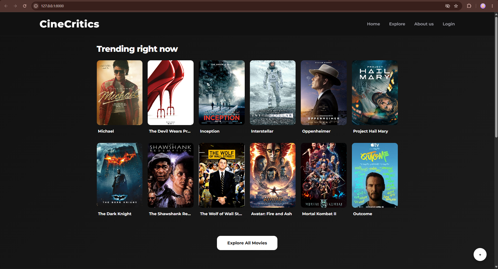
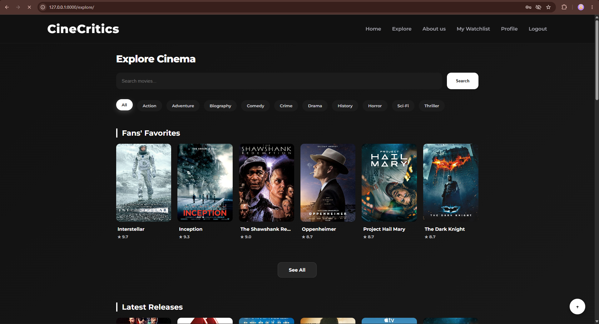
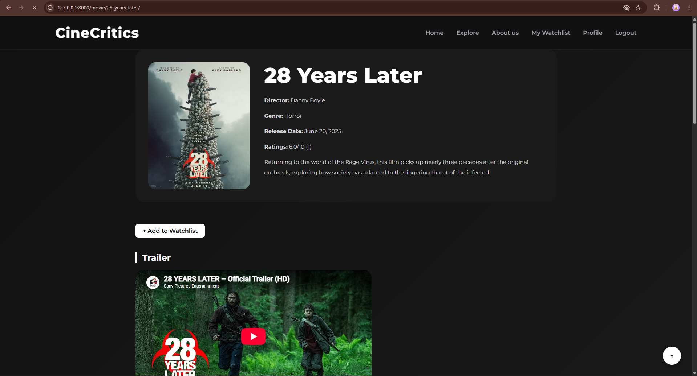
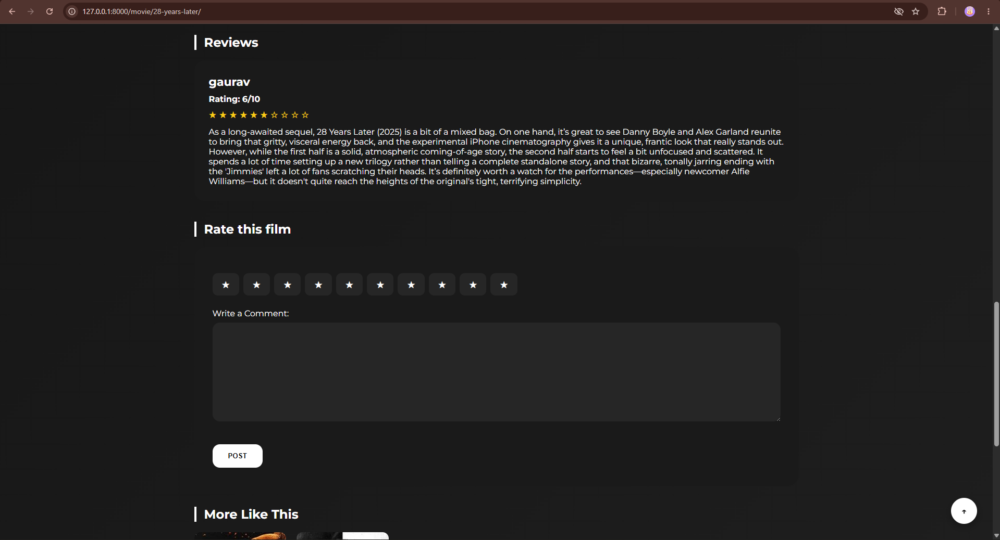
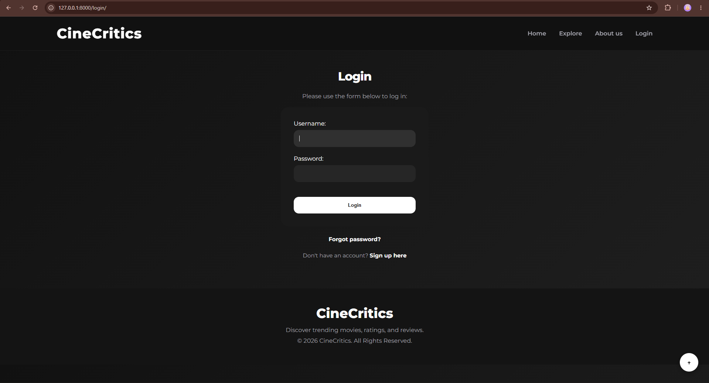
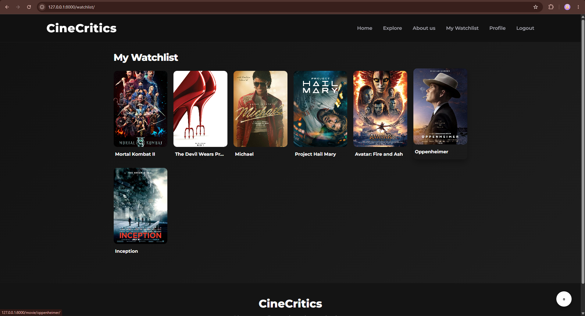
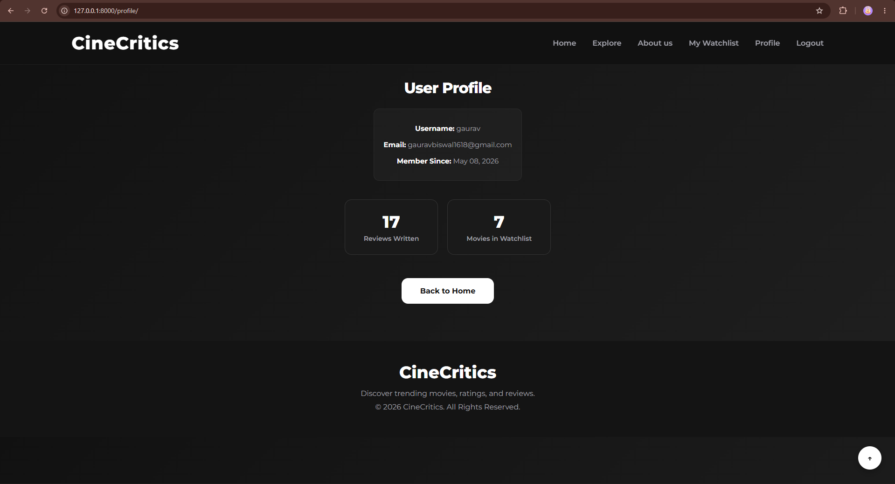

# CineCritics 🎬🍿

A dynamic movie review and discovery platform built with Django.

## Table of Contents 🗺️

- [Project Description](#project-description)
- [Features](#features-✨)
- [Tech Stack](#tech-stack-💻)
- [Installation](#installation--)
- [Usage](#usage--)
- [Project Structure](#project-structure-📁)
- [Contributing](#contributing--)
- [License](#license-⚖️)
- [Important Links](#important-links-🔗)
- [Footer](#footer--)

## Project Description 🌟

CineCritics is a web application designed to be a comprehensive platform for movie enthusiasts. It allows users to discover movies, read reviews, rate films, and manage a personal watchlist. Built with the Django framework, it leverages Python for its backend logic and incorporates modern CSS for a visually appealing user interface.

The platform aims to provide an engaging experience for users to explore cinematic content, share their opinions, and connect with other movie lovers. It features user authentication, enabling personalized experiences and the ability to contribute reviews.

### 📸 Application Preview



*CineCritics homepage showcasing trending movies and the main movie discovery experience.*

## Features ✨

- **Movie Discovery:** Browse trending, upcoming, and categorized movies.



*The Explore page allows users to discover movies through search, genre filters, curated sections, and popular actors.*

- **Detailed Movie Pages:** View movie details including director, genre, description, trailer, photos, and cast.



*Movie detail page displaying information about the film, including its description, trailer, photos, cast, ratings, and user reviews.*

- **User Reviews & Ratings:** Users can submit ratings (1-10) and written reviews for movies.



*Users can rate movies on a 1–10 scale and share their opinions through written reviews.*

- **Average Rating Display:** Movies display their average user rating.
- **User Authentication:** Secure registration, login, and password reset functionality.



*CineCritics provides user authentication with registration, login, logout, and password reset functionality.*

- **Personal Watchlist:** Users can add movies to their personal watchlist and view it separately.



*Authenticated users can save movies to their personal watchlist and access them from a dedicated page.*

- **Actor Profiles:** View a list of actors, with links to their images and names.
- **Search Functionality:** Search for movies by title.
- **Genre Filtering:** Filter movies by their respective genres.
- **Admin Interface:** Django's built-in admin panel for managing movie, review, and actor data.

## Tech Stack 💻

- **Backend:** Python, Django
- **Frontend:** HTML, CSS
- **Database:** SQLite (default)
- **Frameworks:** Django

## Installation ⚙️

This project is built using Python and Django. To set up the development environment, follow these steps:

1.  **Clone the Repository:**
    ```bash
    git clone https://github.com/Gaurav-biswal/CineCritics.git
    cd CineCritics
    ```

2.  **Set up a Virtual Environment (Recommended):**
    ```bash
    python -m venv venv
    # On Windows:
    .\venv\Scripts\activate
    # On macOS/Linux:
    source venv/bin/activate
    ```

3.  **Install Dependencies:**
    The project uses Django. No external `requirements.txt` file was found, but Django is typically installed via pip:
    ```bash
    pip install django
    ```

4.  **Apply Migrations:**
    This will create the necessary database tables.
    ```bash
    python manage.py migrate
    ```

5.  **Run the Development Server:**
    ```bash
    python manage.py runserver
    ```

6.  **Access the Application:**
    Open your web browser and navigate to `http://127.0.0.1:8000/`.

## Usage 🚀

CineCritics provides a user-friendly interface for exploring and interacting with movie content.

### Core Functionalities:

-   **Homepage (`/`)**: Displays trending movies and prompts users to explore or sign up.
-   **Explore Page (`/explore/`)**: The central hub for discovering movies. Here you can:
    -   Search for movies using the search bar.
    -   Filter movies by genre using the genre buttons.
    -   View curated sections like "Fans' Favorites", "Latest Releases", and "Coming Soon".
    -   See a list of popular actors.
-   **Movie Detail Page (`/movie/<slug>/`)**: Click on any movie to view its detailed information, including description, trailer, photos, cast, existing reviews, and the option to add your own review and rating. You can also add/remove the movie from your watchlist.
-   **User Authentication:**
    -   **Register (`/register/`)**: Create a new account.
    -   **Login (`/login/`)**: Log in to your existing account.
    -   **Logout (`/logout/`)**: Log out of your session.
    -   **Password Reset**: Links are available for password reset functionality.
-   **User Profile (`/profile/`)**: View your profile information, including the number of reviews written and movies in your watchlist.



*The user profile provides a personalized overview of review activity and saved movies.*

-   **Watchlist (`/watchlist/`)**: Access your personalized list of movies you wish to watch.
-   **Actors Page (`/actors/`)**: View a list of all actors in the database.

### Example Workflow:

1.  Navigate to the **Explore** page.
2.  Use the search bar to find a specific movie, e.g., "Inception".
3.  Alternatively, browse movies by clicking on a genre, e.g., "Action".
4.  Click on a movie to view its details.
5.  Read existing reviews or submit your own rating and comment.
6.  If interested, add the movie to your **Watchlist**.
7.  Log in to see your profile and personalized **Watchlist**.

## Project Structure 📁

```
CineCritics/
├── manage.py
├── moviehub/
│   ├── __init__.py
│   ├── asgi.py
│   ├── settings.py
│   ├── urls.py
│   └── wsgi.py
├── reviews/
│   ├── __init__.py
│   ├── admin.py
│   ├── apps.py
│   ├── forms.py
│   ├── migrations/
│   │   ├── __init__.py
│   │   ├── 0001_initial.py
│   │   ├── ... (other migration files)
│   ├── models.py
│   ├── static/
│   │   └── css/
│   │       └── style99.css
│   ├── templates/
│   │   ├── registration/
│   │   │   ├── login.html
│   │   │   ├── logout_confirm.html
│   │   │   ├── password_reset_complete.html
│   │   │   ├── password_reset_confirm.html
│   │   │   ├── password_reset_done.html
│   │   │   ├── password_reset_form.html
│   │   │   ├── profile.html
│   │   │   └── register.html
│   │   └── reviews/
│   │       ├── all_actors.html
│   │       ├── base.html
│   │       ├── explore.html
│   │       ├── movie_detail.html
│   │       ├── movie_list.html
│   │       ├── section_list.html
│   │       └── watchlist.html
│   ├── tests.py
│   ├── urls.py
│   └── views.py
└── README.md
```

## How to use 🤔

This project serves as a functional movie review platform. Users can:

*   **Browse and Discover:** Explore movies by different categories, genres, or search queries.
*   **Engage with Content:** Read detailed movie information, watch trailers, view photos, and see cast members.
*   **Contribute Reviews:** Users can sign up, log in, and submit their ratings and reviews for movies.
*   **Personalize Experience:** Maintain a personal watchlist of movies they want to see or have seen.

The `views.py` file contains the core logic for handling requests, interacting with the models, and rendering the appropriate templates. The `urls.py` files map URLs to these views, and the `models.py` defines the database schema for movies, actors, and reviews.

## Contributing 🤝

Contributions are welcome! Please follow these guidelines:

1.  Fork the repository.
2.  Create a new branch (`git checkout -b feature/your-feature`).
3.  Make your changes.
4.  Commit your changes (`git commit -am 'Add some feature'`).
5.  Push to the branch (`git push origin feature/your-feature`).
6.  Open a Pull Request.

Please ensure your code adheres to Python and Django best practices.

## Important Links 🔗

-   **Repository:** [Gaurav-biswal/CineCritics](https://github.com/Gaurav-biswal/CineCritics)

## Footer 👋

✨ **Like this project?** Give it a star ⭐!

❓ **Have questions or found an issue?** Please open an [issue](https://github.com/Gaurav-biswal/CineCritics/issues).

> Author: Gaurav Biswal
